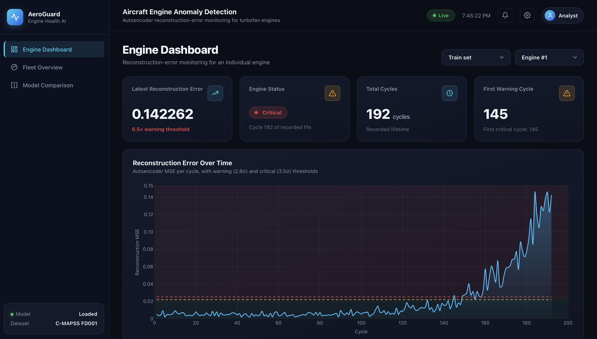
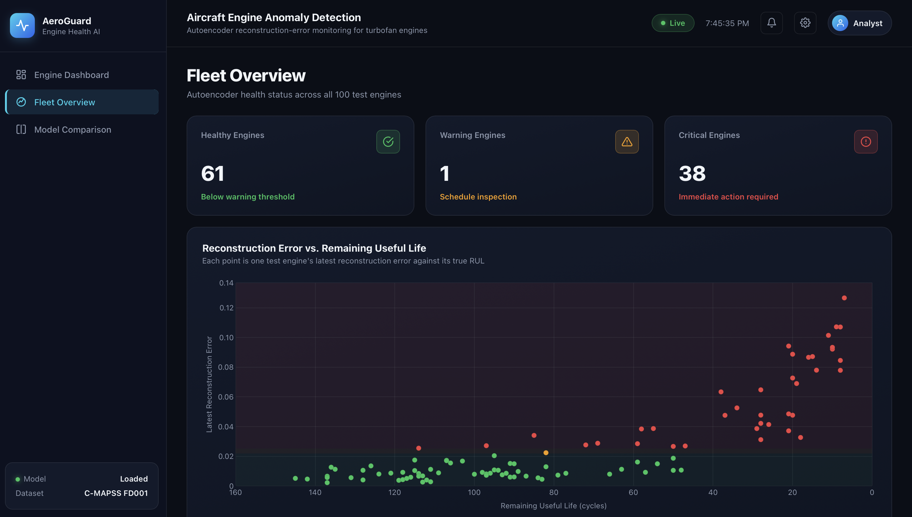
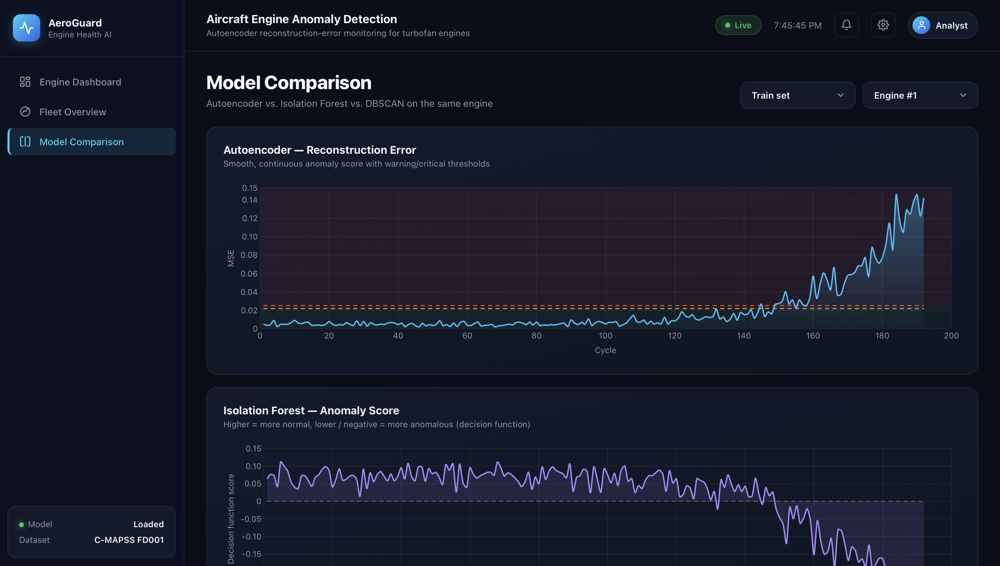

# Aircraft Engine Anomaly Detection

Unsupervised anomaly detection for aircraft engine health monitoring using autoencoders. The system learns normal engine behavior from sensor data and flags deviations that indicate early-stage degradation — without needing any labeled failure data.

## Dataset

NASA C-MAPSS FD001 — 100 turbofan engines, 21 sensors, run-to-failure simulation.

## How It Works

1. 7 constant sensors dropped, 14 useful sensors retained
2. MinMaxScaler normalization (fitted on training data only)
3. First 30% of each engine's lifecycle used as "healthy" training data
4. Autoencoder (14→8→4→8→14) trained to reconstruct healthy sensor readings
5. Reconstruction error used as anomaly score — low error = healthy, high error = degrading
6. Dual threshold alert system:
   - Warning (2.8σ): ~105 cycles early warning, <1 false alarm per engine
   - Critical (3.5σ): ~80 cycles early warning, near-zero false alarms

## Baseline Comparisons

- **Isolation Forest:** ~72 cycles early warning, noisy signal
- **DBSCAN:** unreliable binary flickers, no confidence score
- **Autoencoder** outperforms both in early detection and signal quality

## Validated on Unseen Data

Tested on 100 completely unseen engines (test_FD001.txt). Clear inverse correlation between reconstruction error and actual remaining life — dying engines show high error, healthy engines stay below thresholds.

## Tech Stack

- **ML:** Python, Pandas, NumPy, PyTorch (Autoencoder), Scikit-learn (Isolation Forest, DBSCAN, MinMaxScaler)
- **Backend:** Flask
- **Frontend:** HTML, CSS, vanilla JS, Chart.js

## Dashboard

Three pages with dark-themed industrial UI:

### Engine Dashboard

Select any train or test engine. View reconstruction error timeline with warning/critical zones, engine status, and key metrics.



### Fleet Overview

Scatter plot of reconstruction error vs remaining life across all 100 test engines. Sortable table with health status for every engine.



### Model Comparison

Side by side comparison of Autoencoder, Isolation Forest, and DBSCAN for the same engine. Visual proof of why the autoencoder wins.



## Setup

```
python3 -m venv venv
source venv/bin/activate
pip install -r requirements.txt
python app.py
```
